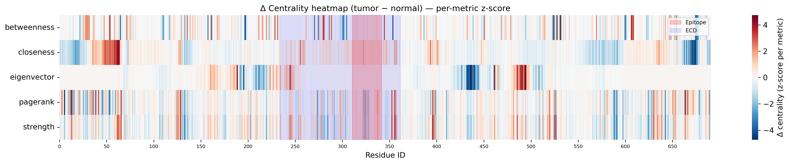
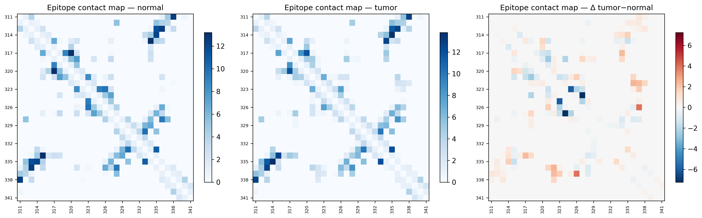
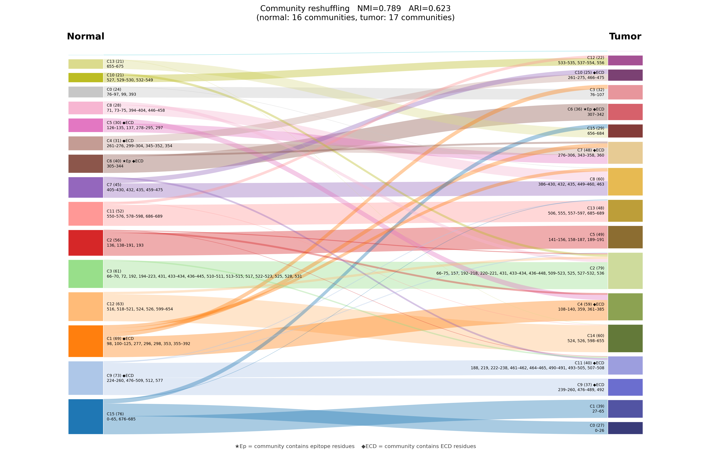
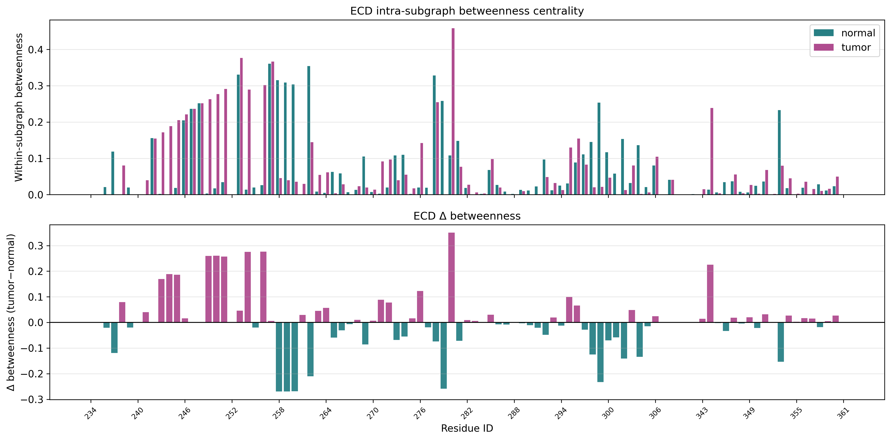

# NaPi2b Structural Bioinformatics Project

A structural bioinformatics project focused on the NaPi2b transporter (SLC34A2), combining molecular dynamics, residue interaction networks, and graph-based topological analysis to study microenvironment-dependent remodeling in normal and tumor-like conditions.

## Overview

This repository contains the analytical workflow used to process NaPi2b molecular dynamics trajectories and convert them into biologically interpretable graph representations. The project is centered on the hypothesis that tumor-like conditions can induce hidden local rewiring in extracellular regions and epitope-associated subdomains even when classical global MD descriptors show only limited differences.

The repository is organized around two main analytical stages, plus a stable results layer that both stages read from and write to:

- **Phase3A: preprocessing and feature extraction** — standardized extraction of residue-level, contact-level, and non-protein interaction data from molecular dynamics trajectories.
- **Phase3B: topological graph analysis** — construction and analysis of residue interaction networks, including centrality, community structure, regional epitope analysis, and temporal graph behavior.
- **results/**: versioned tables, manifests, and figures produced by the two notebooks, kept separate from the analysis code itself.

## Biological motivation

NaPi2b (SLC34A2) is a membrane transporter of interest in cancer research, particularly in ovarian cancer, where it is considered a relevant biomarker and therapeutic target. Because tumor microenvironments differ from normal tissue in pH, membrane composition, and interaction context, the project investigates whether these conditions affect the structural and topological organization of extracellular NaPi2b regions that may be relevant for recognition and targeting.

## Research question

The main question addressed in this repository is:

> Can tumor-like conditions reshape the local residue interaction topology of NaPi2b in ways that are not fully captured by classical MD metrics, but become visible after transforming trajectories into residue interaction networks?

## Key findings

The current pilot analysis compares NaPi2b under normal (`NORM`) and tumor-like (`TUMOR`) conditions using both classical MD descriptors and residue interaction network (RIN) topology.

**Classical MD descriptors show reduced global mobility, but no epitope-specific effect.**
Global RMSD decreases from 0.72 ± 0.29 nm (`NORM`) to 0.56 ± 0.15 nm (`TUMOR`), while the radius of gyration remains essentially unchanged (3.64 nm vs 3.63 nm). Within the epitope region (residues 324–338), RMSF and Rg show no statistically significant difference between conditions (RMSF p = 0.23, Rg p = 0.97). In isolation, these descriptors would suggest that tumor-like conditions only reduce overall flexibility without touching the epitope itself.

**Residue interaction network topology reveals a localized effect that classical metrics miss.**
After converting trajectories into per-frame RINs and computing degree, closeness, betweenness, and eigenvector centrality, a subdomain-level rewiring becomes visible within the epitope region, concentrated in residues 323–327 and 335, where all four centrality metrics drop by roughly 60–80% in `TUMOR` relative to `NORM`. Ser326 is the most affected position, with eigenvector centrality dropping by approximately 99–100%.




**The epitope shifts into a different network community between conditions.**
Community detection shows that the epitope region belongs to a large, heterogeneous structural module under `NORM`, but is reassigned to a more compact, extracellular-dominated module under `TUMOR`. The residues keep a similar local geometry, but their position in the protein's communication network changes.



**Regional (ECD/epitope) betweenness confirms the effect is local, not global.**
Betweenness centrality computed specifically within the extracellular domain (ECD) and epitope subgraphs shows the same directionality as the whole-protein analysis, supporting that the rewiring is a regional phenomenon rather than an artifact of whole-graph normalization.



**Working interpretation.**
Classical MD descriptors capture global stability and mobility but are not sensitive to subdomain-level reorganization of the interaction network. Graph-based topological analysis localizes this reorganization to specific residues (323–327, 335, and especially Ser326) and to a change in community membership of the epitope. This supports the hypothesis that altered antibody recognition of NaPi2b under tumor-like conditions may be driven by rewiring of the intramolecular interaction network around the epitope rather than by large-scale conformational change.

## Systems analyzed

Two condition-specific systems are processed through the same analytical logic:

| System | Description |
|---|---|
| `normal` (`NORM`) | Reference condition used as the structural and topological baseline: physiological pH and a healthy epithelial-like lipid/ionic composition. |
| `tumor` (`TUMOR`) | Tumor-like condition used to evaluate condition-dependent rewiring of the NaPi2b interaction network: acidic pH and a tumor-associated lipid/ionic composition. |

Both conditions are processed through a common export and analysis pipeline, making downstream comparison reproducible and explicit.

## Simulation conditions

The trajectories analyzed in this repository come from an equilibrium all-atom MD pilot, one continuous production run per condition (30 ns, no replicas). This section documents how the two systems (`NORM`, `TUMOR`) were built and run.

### Structural starting point

- Protein model: NaPi2b, 690 residues.
- Glycosylation: N-glycans (FA2G2S2) modeled at Asn295 and Asn308.
- Disulfide bridges included as resolved in the starting structure.
- Systems built in CHARMM-GUI (Membrane Builder), force field CHARMM36m, TIP3P water.
- Water layer thickness: 30 Å. Box size: 130 Å (`NORM`) / 135 Å (`TUMOR`).

### Asymmetric lipid bilayer composition

The plasma membrane was modeled as an asymmetric bilayer with condition-specific outer/inner leaflet composition (mol %):

| Condition | Leaflet | POPC | PSM | POPS | POPI | CHOL | POPE | GM1 | GM3 | Σ |
|---|---|---|---|---|---|---|---|---|---|---|
| **NORM** | Outer | 47 | 8 | 5 | 5 | 30 | — | 5 | — | 100% |
| **NORM** | Inner | 13 | — | 12 | 11 | 19 | 45 | — | — | 100% |
| **TUMOR** | Outer | 38 | 10 | 8 | 5 | 30 | — | — | 5 | 100% |
| **TUMOR** | Inner | 9 | — | 6 | 12 | 23 | 50 | — | — | 100% |

Rationale for the tumor-associated shifts:

- **PC** decreases in the tumor outer leaflet, reflecting the reported reduction of phosphatidylcholine in tumor membrane remodeling.
- **SM and CHOL** increase in the tumor outer leaflet, consistent with raft rigidification and reduced membrane fluidity reported in tumor cells.
- **PS** is exposed at low levels in the tumor outer leaflet (5%), reflecting loss of flippase-mediated asymmetry seen in malignant cells, while remaining sequestered in the inner leaflet under `NORM`.
- **GM1 → GM3 switch**: GM1 is present only in `NORM` (healthy epithelial raft ganglioside), replaced by GM3 in `TUMOR`, consistent with the ganglioside remodeling associated with tumor RTK signaling (EGFR/HER2) and reported relevance in ovarian cancer.
- **PE** dominates the inner leaflet in both conditions (45–50%), consistent with its physiological role in inner-leaflet curvature.
- **PI** is elevated in the inner leaflet in both conditions (11–15%), consistent with its role as a PI3K signaling substrate.

Ions and any counterions automatically added by CHARMM-GUI were removed and re-added explicitly in a separate ionization step (below), so that final ionic strength matches the target physiological/tumor-like composition exactly.

### Protonation state (pH-dependent, fixed for production)

Protonation states of titratable residues were assigned per condition using `pdb2pqr` with PROPKA at the condition-specific pH, and then **fixed** for the production run (no constant-pH/λ-dynamics in this pilot):

```bash
# NORM
pdb2pqr --ff CHARMM --with-ph 7.4 --titration-state-method propka \
        --pdb-output system_pH74.pdb step5_input.pdb system_pH74.pqr

# TUMOR
pdb2pqr --ff CHARMM --with-ph 6.8 --titration-state-method propka \
        --pdb-output system_pH68.pdb step5_input.pdb system_pH68.pqr
```

Assigned protonation states:

| Residue | pKa | Charge at pH 7.4 (`NORM`) | Charge at pH 6.8 (`TUMOR`) |
|---|---|---|---|
| HIS | 6.0 | ~0 (≈10% protonated) | ~+0.5 (≈50% protonated) |
| N-terminus | 8.0 | +0.5 | +0.8 |
| ASP | 3.9 | −1 | −1 |
| GLU | 4.2 | −1 | −1 |
| LYS | 10.5 | +1 | +1 |
| Sialic acid (SIAL / N5EAC) | 2.6 | −1 (fixed CHARMM36 carbohydrate charge) | −1 (fixed CHARMM36 carbohydrate charge) |

Topology was then generated per condition with the standard CHARMM36m force field (`pdb2gmx`, TIP3P water, hydrogens rebuilt from the assigned protonation state).

### Ionic composition

| Salt | `NORM` | `TUMOR` |
|---|---|---|
| NaCl | 0.145 M | 0.170 M |
| KCl | 0.005 M | 0.005 M |
| CaCl₂ | 0.0025 M | 0.0025 M |
| MgCl₂ | 0.001 M | 0.00065 M |

Ions were added stepwise with `gmx genion`/`gmx insert-molecules` (neutralization + NaCl, then K⁺, then Ca²⁺, then Mg²⁺), updating the `[ molecules ]` section of the topology after each step.

### Equilibration and production (standard GROMACS, fixed protonation)

- **Energy minimization**: steepest descent, 5000 steps, `emtol = 500 kJ·mol⁻¹·nm⁻¹`.
- **NVT equilibration**: 3–5 ns, v-rescale thermostat (τT = 0.1 ps), target temperature 310 K (`NORM`) / 312 K (`TUMOR`), position restraints on protein heavy atoms (1000 kJ·mol⁻¹·nm⁻²).
- **NPT equilibration**: 5–10 ns, Berendsen barostat (τP = 1.0 ps), semi-isotropic pressure coupling at 1 bar, restraints released stepwise.
- **Production**: **30 ns equilibrium MD per condition, single continuous run (no replicas)**, standard GROMACS integrator (`md`), fixed protonation state from the PROPKA assignment above — i.e., no constant-pH/λ-dynamics were used for the trajectories analyzed in this repository.
- **Trajectory sampling**: 300 frames extracted per condition for downstream residue-level and graph-based analysis (Phase3A/Phase3B).

### Trajectory-level QC

Standard convergence and stability checks were computed per condition before downstream graph analysis:

```bash
gmx rms    -f md.xtc -s md.tpr -o rmsd.xvg    # convergence threshold ~0.3–0.5 nm
gmx rmsf   -f md.xtc -s md.tpr -o rmsf.xvg
gmx gyrate -f md.xtc -s md.tpr -o rg.xvg
gmx sasa   -f md.xtc -s md.tpr -o sasa.xvg
```

These outputs feed directly into the QC panels referenced in [Figures](#figures) and into the `residuetable_*.csv` exports described in `docs/data-contract.md`.

## Pipeline structure

### Phase3A — preprocessing

Phase3A converts raw trajectory-derived information into a standardized set of exports for graph-based downstream analysis. This stage includes residue feature extraction, contact definition, integration of lipid and glycan context, and generation of machine-readable artifacts.

Key outputs from this stage include:

- residue tables for each condition,
- protein contact edge tables, including undirected variants,
- lipid, glycan, and non-protein node tables,
- non-protein contact edge files,
- heterograph exports for graph workflows,
- 3D coordinate mappings for structural visualization,
- per-frame contact edge parquet files for temporal analysis.

### Phase3B — graph analysis

Phase3B consumes the exported Phase3A artifacts and performs graph-based analysis of NaPi2b under each condition. This includes graph QC, consensus network generation, condition-wise centrality comparison, regional extracellular domain and epitope analysis, community detection, and temporal residue interaction network analysis.

The notebook also contains figure-generation logic for publication-style outputs, including regional contact views, community reshuffling summaries, and temporal graph metric panels. All numeric and visual outputs are written to `results/`, not left inline in the notebook, so they can be reused without re-running the analysis.

## Repository goals

This repository is designed to serve several purposes at once:

- a reproducible scientific workspace for NaPi2b structural analysis,
- a transparent bridge between molecular dynamics and graph-based biological interpretation,
- a foundation for future pipeline modularization and packaging,
- a basis for downstream mutation analysis, ML experiments, and interactive tooling.

## Repository layout

```text
./
├─ README.md
├─ docs/
│  ├─ project-overview.md
│  ├─ data-contract.md
│  └─ repository-map.md
├─ notebooks/
│  ├─ Phase3A_preprocessing_scientific_v5.6.ipynb
│  └─ Phase3B_Topological_Graph_Analysis_v6.ipynb
└─ results/
   ├─ figures/
   │  ├─ qc_degree_distribution
   │  ├─ ecd_contact_maps
   │  ├─ ecd_contact_profile
   │  ├─ epitope_contact_maps
   │  ├─ epitope_contact_profile
   │  ├─ fig1_delta_centrality_heatmap
   │  ├─ fig2_scatter_normal_vs_tumor
   │  ├─ fig3_community_bar
   │  ├─ fig3b_alluvial
   │  ├─ fig3c_network_communities
   │  ├─ fig4_subgraph_top30
   │  ├─ fig6_ECD_subgraph_betweenness
   │  ├─ fig6_epitope_subgraph_betweenness
   │  ├─ fig_temporal_rin
   │  └─ fig_temporal_rin_delta
   ├─ manifests/
   │  ├─ config.yaml
   │  ├─ dataset_manifest.json
   │  ├─ edge_semantics.json
   │  └─ topology_stats.json
   └─ tables/
      ├─ centrality_delta.xlsx
      ├─ community_normal.xlsx
      └─ community_tumor.xlsx
```

`docs/` contains short supporting pages: `project-overview.md` (extended scientific description), `data-contract.md` (exact fields and files passed between Phase3A and Phase3B), and `repository-map.md` (a guided tour of every folder). `results/manifests/` records the exact configuration (`config.yaml`), dataset provenance (`dataset_manifest.json`), edge-type definitions (`edge_semantics.json`), and summary topology statistics (`topology_stats.json`) used to generate everything in `results/tables/` and `results/figures/`.

## Figures

The figures in `results/figures/` fall into four groups, ordered the way a new reader should look at them.

**Quality control**
- **qc_degree_distribution** — degree distribution of the residue interaction network, used to sanity-check graph construction before any biological comparison.

**Global centrality comparison**
- **fig1_delta_centrality_heatmap** — per-residue change in centrality between `normal` and `tumor`, the primary summary figure for whole-protein rewiring.
- **fig2_scatter_normal_vs_tumor** — residue-level centrality in `normal` plotted against `tumor`, highlighting residues that deviate from the diagonal.

**Community structure**
- **fig3_community_bar** — community size and composition per condition.
- **fig3b_alluvial** — alluvial diagram tracking how residues move between communities from `normal` to `tumor`.
- **fig3c_network_communities** — network layout colored by community assignment, condition by condition.
- **fig4_subgraph_top30** — induced subgraph of the top 30 residues by centrality, used to inspect the local wiring around the most central nodes.

**Regional and temporal analysis (ECD and epitope)**
- **ecd_contact_maps** / **ecd_contact_profile** — contact maps and aggregated contact profile for the extracellular domain (ECD).
- **epitope_contact_maps** / **epitope_contact_profile** — contact maps and aggregated contact profile restricted to the epitope-associated subdomain.
- **fig6_ECD_subgraph_betweenness** / **fig6_epitope_subgraph_betweenness** — betweenness centrality within the ECD and epitope subgraphs specifically, isolating regional effects from whole-protein trends.
- **fig_temporal_rin** / **fig_temporal_rin_delta** — sliding-window graph metrics over the trajectory and their condition-wise delta, showing that rewiring is a dynamic, not only static, effect.

## How to start

For a new reader, the recommended entry points are:

1. Read this `README.md` for the project scope, key findings, and simulation conditions.
2. Read `docs/project-overview.md` for the extended scientific narrative.
3. Read `docs/data-contract.md` to understand what each Phase3A export contains and how Phase3B consumes it.
4. Browse `results/figures/` in the order listed above: QC → global centrality → communities → regional/temporal.
5. Open `notebooks/Phase3A_preprocessing_scientific_v5.6.ipynb` to see how the exports in `results/` are produced.
6. Open `notebooks/Phase3B_Topological_Graph_Analysis_v6.ipynb` to see how the figures and tables are generated from those exports.

## Current status

Preprocessing exports and graph analytics are explicitly connected through a stable `results/` layer with dedicated `figures/`, `manifests/`, and `tables/` subfolders. The repository already reflects a mature analysis logic; the next step toward external usability is refactoring the reusable notebook logic into package-style helper modules.

## Future work

- Refactor reusable notebook logic into package-style helper modules.
- Extend condition comparison toward mutation-aware analysis, including disease-relevant variants such as T330M.
- Extend the current fixed-protonation, single-run pilot (30 ns, no replicas) toward multi-replica production and, at a later stage, constant-pH/λ-dynamics (FMM-CpHMD) simulations, as documented separately in the MD protocol.
- Connect the workflow to a more formalized pipeline and visualization interface: https://github.com/2Myaka2/MANIA_WANIA/

## Russian summary

Этот репозиторий посвящен анализу транспортера NaPi2b (SLC34A2) методами структурной биоинформатики, объединяющими молекулярную динамику, residue interaction networks и топологический анализ графов. Репозиторий состоит из двух ноутбуков (Phase3A — препроцессинг, Phase3B — топологический анализ) и слоя `results/` с фигурами, манифестами и таблицами, которые они производят.

Симуляции представляют собой равновесную полноатомную MD (30 нс, без реплик, GROMACS + CHARMM36m) для двух условий: NORM (pH 7.4, липидный и ионный состав здорового эпителия) и TUMOR (pH 6.8, опухолеассоциированный липидный и ионный состав, включая замену GM1 на GM3 и частичную экспозицию PS в наружном листке). Протонирование титруемых остатков задавалось через pdb2pqr/PROPKA под целевой pH и фиксировалось на всё время продакшн-расчёта; constant-pH/λ-dynamics в этом пилоте не использовались.

Классические MD-дескрипторы (RMSD, RMSF, Rg) показывают снижение глобальной подвижности в TUMOR при отсутствии значимых различий в эпитопном регионе (324–338), тогда как анализ residue interaction networks выявляет локальную перестройку центральности в остатках 323–327 и 335, с почти полной потерей eigenvector centrality у Ser326, а также переход эпитопа в другой сетевой модуль (community) между условиями. Это поддерживает гипотезу, что изменение эффективности распознавания NaPi2b антителами в опухолевых условиях может быть связано со скрытой перестройкой сети внутримолекулярных взаимодействий, а не с крупной геометрической перестройкой.
